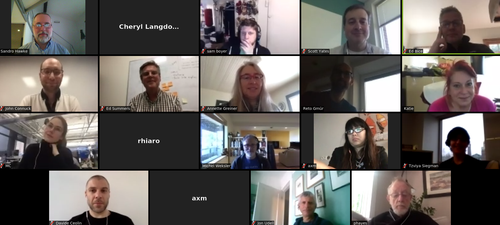

## W3C Credible Web Community Group

See mission, members, and how to join at [W3C group page](https://www.w3.org/community/credibility/)

Group website at <https://credweb.org> (driven by [github pages](https://github.com/w3c/credweb)).

### Documents (not yet reflecting group consensus)

* [Presentation to W3C Advisory Committee](http://hawke.org/talk-ac-2018/)
* [CCIV (Content Credibility Indicators Vocabulary)](https://credweb.org/cciv)

### Meetings

Wednesdays 1705-1830 UTC [how to connect](how-to-connect.md)

Polls: [Weekly meeting time](https://doodle.com/poll/n5udgwf3vrm3q2sw), [July meeting dates](https://doodle.com/poll/qudimieecq8kapdn)

* 2018-05-23 [Agenda: Area 2 (Fact Checking)](agenda/20180523.md)
----

* 2018-05-16 **No Meeting**
* 2018-05-09 [Agenda](agenda/20180509.md), [minutes](./minutes/20180509.html), [chat log](https://credweb.zulipchat.com/#narrow/stream/114583-meeting/topic/2018-05-09)
* 2018-05-02 [Agenda](agenda/20180502.md), [minutes](./minutes/20180502.html), [chat log](https://credweb.zulipchat.com/#narrow/stream/114583-meeting/topic/2018-05-02)
* 2018-04-25 [Agenda](agenda/20180425.md), [minutes](./minutes/20180425.html), [chat log](https://credweb.zulipchat.com/#narrow/stream/114583-meeting/topic/2018-04-25)
* 2018-04-18 [Agenda](agenda/20180418.md), [minutes](./minutes/20180418.html), [chat log](https://credweb.zulipchat.com/#narrow/stream/114583-meeting/topic/2018-04-18)
* 2018-04-11 [Agenda](agenda/20180411.md), [minutes](./minutes/20180411.html), [chat log](https://credweb.zulipchat.com/#narrow/stream/114583-meeting/topic/2018-04-11)
* 2017-11-10 [Agenda](https://www.w3.org/wiki/File:Credibility-2017-11-10-agenda.pdf), [Minutes](https://www.w3.org/community/credibility/wiki/2017-11-10-minutes)
* 2017-11-08 [TPAC Breakout Minutes](https://www.w3.org/community/credibility/wiki/2017-11-08-minutes)

[Related events calendar](https://calendar.google.com/calendar/embed?src=certifiedcontentcoalition.org_9cd49bitubv0sicvpt6gvf9km0%40group.calendar.google.com),
[Related activities & organizations](https://docs.google.com/spreadsheets/d/1vWE3iOn6yxUsRJyS_mks83m0Gwv_7cK0WtVt-SNsYzY/edit#gid=0)