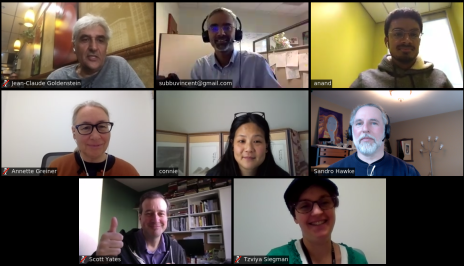

## W3C Credible Web Community Group

About:
* See our [mission, blog, and list of members](https://www.w3.org/community/credibility/)
* This is a [Community Group](https://www.w3.org/community/) of the [W3C](https://www.w3.org), the web standards organization
* [How to join](joining).
* [Mailing list archives](https://lists.w3.org/Archives/Public/public-credibility/), mostly for announcements
* [Website: credweb.org](https://credweb.org) backed by [this repo](https://github.com/w3c/credweb)
* [Issues](https://github.com/w3c/credweb/issues) for discussion, on GitHub

### Documents

* **Credibility Tech**: [Final 2018 Report](https://www.w3.org/2018/10/credibility-tech/), [Versions](https://credweb.org/credibility-tech)
* **Credibility Signals**: [Reviewed Signals (Public Draft)](https://credweb.org/reviewed-signals/), [Versions](https://credweb.org/signals/), [Review Process Tracking](https://docs.google.com/document/d/1i6lCJPaJLQwrDUknnzWW5ixgWb8xp54KdLu2mam206Q/edit)
* Slides: [2019-05 Web Conference](https://docs.google.com/presentation/d/17-Of0UWivD7q61fm1SQJcaJUcHMQ1lJxrqMK5PZQeCM), [2018-05 W3C Advisory Committee](http://hawke.org/talk-ac-2018/)
* [Google drive folder](https://drive.google.com/drive/u/0/folders/1BIXNJb7ggBUBBNS76-WRvMmGR4vC6ijt)

### Meetings

Most meetings use [this zoom link (changed Aug 2021)](https://us02web.zoom.us/j/87526152790?pwd=cHdKZ0tmWjh2OUxsUEh2eE5Nck8xQT09). Please try to be
on-camera, if possible. For more, see [how to
connect](how-to-connect.md). 

Upcoming:

* 2021-10-15 1:30pm ET Open meeting to talk about building of a test suite for anti-misinformation initiatives [calendar invite with zoom link](https://calendar.google.com/event?action=TEMPLATE&tmeid=N3J0MHNicGs3bjg5Y21hNXBrdWVuMjRncGsgY18ycjhmMTY0MTRyMzFtdjVnZWRjc24ybjBlc0Bn&tmsrc=c_2r8f16414r31mv5gedcsn2n0es%40group.calendar.google.com).  [agenda+record](https://docs.google.com/document/d/1713YbAEbQ4qz-9NJbtF9PiDay7ZNzOrD-j7ZR0w_te0/edit?usp=sharing)

Past:

* 2021-08-26 1pm ET Election discussion [agenda+record](https://docs.google.com/document/d/1aKcFSVZne98AMgdJQk-M6SQLcItQQNQgN-PdCDXePaE/edit#)
* 2021-08-16 3pm ET General discussion on group and member activities [agenda+record](https://docs.google.com/document/d/1fZNExB1LyZ-J274C3fuParU9ClnjjbDf_ljKYP3JlG0/edit)
* 2020-06-24 General discussion on group member's activities [agenda+record](https://docs.google.com/document/d/1SZ8gMJ23v9FyvceFcSUxNkrH1R2lyzRMKO78xhbabBI/edit)
* 2020-05-27 Daniel Schwabe, [on Claim Checking and Trust](/slides/20200527-schwabe.pdf). [agenda+record](https://docs.google.com/document/d/11_NeoIwxQDJulB8CZcTqMmuJYxz2roDYWTOXVSkxlB4/edit#)
* 2020-05-13 Arjun Moorthy, [The Factual](https://www.thefactual.com/), [slides](https://credweb.org/slides/20200513.pdf), [agenda+record](https://docs.google.com/document/d/1DhEJbQDgWeXp_AMdQcmdo2sI6ZV_RH7zNKp_OElNw-4/edit#) 
* 2020-04-29: Credibility Networks for Content Warnings. [agenda+record](https://docs.google.com/document/d/1Rm0Eny3JuO5sKdUrqtQLop8mmKZOqiGXw21YyIiI3b0/edit)
* 2020-04-15: DeepTrust Alliance; JournalList . [agenda+record](https://docs.google.com/document/d/1N5hxKcBzoyGqHQwWRbU10YR3qrhwkn1G5Pr1qb1HBTM/edit#heading=h.7g34rh5357yb)
* 2020-04-08: Credibility Networks for COVID-19 response. Agenda and meeting record [gdoc](https://docs.google.com/document/d/1kBQcgLekhcvvsm7Hotoy60bYqUziP1ID-xp4Y-ukaIE/edit)
* 2020-04-01: Credibility Networks for COVID-19 response. Agenda and meeting record [gdoc](https://docs.google.com/document/d/1SAH4u21D16oGtP2CVKnxgd6h4gGcSyJxHsuGtolujpM/edit)
* 2020-03-25: Reputation graph for COVID-19 response. Agenda and meeting record [gdoc](https://docs.google.com/document/d/1wD71FRI3LXCUVbS2ZFxyZXcj8ZqWMJR92cM5otsO-KE/edit#)
* 2020-03-18: Brainstorming covid-19 response. Agenda and meeting record [gdoc](https://docs.google.com/document/d/1wD71FRI3LXCUVbS2ZFxyZXcj8ZqWMJR92cM5otsO-KE/edit#)
* 2020-03-11: Signals review. Agenda and meeting record [gdoc](https://docs.google.com/document/d/1mWqxtHDKi1Hcx7zbqhLjLXTIcYT4DCYP9s0CJ65sRXA/edit#)
* 2020-02-26: Adobe & the Content Authenticity Initiative. [slides PDF](slides/20200226-cai.pdf) Agenda and meeting record [gdoc](https://docs.google.com/document/d/1DwTkZBYeX3yLFvz38eCjOvxR8dlxgsdFMlHoIjlCBm4/edit)
* 2020-02-19: Publication decisions; More review of Journalism Award. Agenda and meeting record [gdoc](https://docs.google.com/document/d/1-KcB121I6D6J2ZdQET-qatqCaqv3ttlZkfhgyWEk7nM/edit)
* 2020-02-13: DATF: Options for RDF [gdoc](https://docs.google.com/document/d/1a9g6AKFjWffmmnmKyCD7upVIZRt0B18V1GlMXlPoo_0/edit)
* 2020-02-12: Review Signal "Journalism Award" [gdoc](https://docs.google.com/document/d/187x-c07QibjS7NLHFmdlhMhFv0IG2jx6bH9sCGvAM1w/edit)
* 2020-02-06: (data access task force - rdf mapping) [gdoc](https://docs.google.com/document/d/1UnQNpgAfY80-KvmLtredvbyhvhHHCPP6teQfTKdXQ94/edit)
* 2020-02-05: review signals: corrections policy, journalism awards [gdoc](https://docs.google.com/document/d/1KCcgASPLnBBQ9XCqDY2L-T0_41HFjbQ0AUi06Ppv2dU/edit)
* 2020-01-28: Approving some signal definitions. Agenda and meeting record [gdoc](https://docs.google.com/document/d/1VvIMSa-vc7Wt6AYAhQ3MrcZTJvuW8kv-QaNWWgbU7Vo/edit#).
* 2020-01-21: Group planning; Endorsing a few signals. Agenda and meeting record [gdoc](https://docs.google.com/document/d/1Zegy2ASbsRtkz8vNVYUXHopZjjXbZweJ5Co8TEW_8w0/edit#).
* 2020-01-14: No meeting (conflict with NewsQ event)
* 2020-01-07: No meeting (cancelled)
* 2019-12-17: Revisit [Attaining Adoption](https://docs.google.com/document/d/1WWYQ33Y9ENcueiFnrb3hJzD2rxKCRw9ok8T3PrDLOB8/edit#heading=h.rmx3ty7g6ge9)); [Credibility Scoring](https://docs.google.com/document/d/1x3TytIJU-bsyGfNdqx8yWybESlyQaQEDhhJf73tNI_c/edit#heading=h.cz6d6op6saw2). Agenda and meeting record: [gdoc](https://docs.google.com/document/d/1LgR_b_8Q_LtP1eeBU2Rggldu6sg303yG4JYYpojcPH4/edit#heading=h.3qvsza8ot2e9)
* 2019-12-10: NewsQ Signals Continued. Agenda and meeting record: [gdoc](https://docs.google.com/document/d/1YJdO32HOG_O0iA5m0fqIc5ikekYSCUGMacCkKmHLd64/edit#)
* 2019-12-03: NewsQ Signals. [Selected](https://credweb.org/signals-beta/#newsq-highlight). Agenda and meeting record: [gdoc](https://docs.google.com/document/d/1FpBZL6lbdfMclCJ-4lI_mPdGfIbSc2zrOjtmeiwkpPw/edit)
* 2019-11-26: No meeting - US Thanksgiving Week 
* 2019-11-19: Revising the Report ([this document](https://credweb.org/report/)): [gdoc](https://docs.google.com/document/d/1bPVcan7bMI6vL7dM4-v3_hop3e05ptgNtbJqqVlROdk/edit)
* 2019-11-12: IPTC. Agenda and meeting record: [gdoc](https://docs.google.com/document/d/1KFQ7rGf63v3SyK_vffhHLfFlm5DGGiHKtaJ5YQSqc48/edit)
* 2019-11-05: ClaimReview. Agenda and meeting record: [gdoc](https://docs.google.com/document/d/1_eOOdvgYrIVEw6Ug2eiSqPjPPfKy0pE2djyUk1pqkcA/edit)
* 2019-10-29: Credibility scores. Agenda and meeting record: [gdoc](https://docs.google.com/document/d/1Va2TmDAH70ugm0h7l-Z14IztSbHe2v7PpZ34BMhTXio/edit)
* 2019-10-22: Presentation on [AM!TT](https://github.com/misinfosecproject/amitt_framework/wiki). Agenda and meeting record: [gdoc](https://docs.google.com/document/d/1jbUzm7jBcZBl5FLfVFH5bi-3x4_e1eOBBBmH-ON9Rp0/edit) and [slides](/slides/20191022-amitt.pdf) 
* 2019-10-15: Presentation on [JTI](https://jti-rsf.org/). Agenda and meeting record: [gdoc](https://docs.google.com/document/d/1Bj_l0fR7k4-3pyVK5iaKnAz0_LMUBBNDoS8Lh57Hf20/edit)
* 2019-10-08: Presentation on [NewsQA](https://newsqa.org/). Agenda and meeting record: [gdoc](https://docs.google.com/document/d/1hng3ceAUBuyT-x1Ny-PqtO5YFrWMwZ1SoxBf7JSOXUE) 
* 2018-10-23 / 2018-10-26: Face-to-face meeting [f2f3](f2f3) (Lyon, France)
* 2018-09-05 Wed Main group [Agenda](agenda/20180905.md)
* 2018-08-29 Wed Main group *canceled* [Agenda](https://lists.w3.org/Archives/Public/public-credibility/2018Aug/0013.html), [Cancelation](https://lists.w3.org/Archives/Public/public-credibility/2018Aug/0014.html)
* 2018-08-22 Wed Main group [Agenda](agenda/20180822.md), [Summary](https://lists.w3.org/Archives/Public/public-credibility/2018Aug/0009.html)
* 2018-08-16 Area-1 Inspection subgroup (with CredCo) Noon US/Eastern, [agenda](https://lists.w3.org/Archives/Public/public-credibility/2018Aug/0003.html), [minutes](https://docs.google.com/document/d/1kjb7_qHhW1m2GMDPxnedcrJVyMSPSIQPMnxpgsU6lus)
* 2018-08-15 Wed Main group [Agenda](agenda/20180815.md), [minutes](./minutes/20180815.md)
* 2018-07-26 / 2018-07-27 **Face to Face meeting SF**, [Agenda](f2f2.md), [minutes](./minutes/f2f2.md)
* 2018-07-25 Wed _No Main group meeting_ (day before F2F)
* 2018-07-23 Mon _No Subgroup-1 group meeting_ 
* 2018-07-18 Wed Main group [Agenda](agenda/20180718.md), [minutes](./minutes/20180718.md)
* 2018-07-16 Mon Area-1 Inspection subgroup [Agenda](agenda/20180716.md), [minutes](./minutes/20180716.md)
* 2018-07-11 Wed Main group [Agenda](agenda/20180711.md), [minutes](./minutes/20180711.md)
* 2018-07-02 Mon Area-1 Inspection subgroup [Agenda](agenda/20180702.md), [minutes](./minutes/20180702.md)
* 2018-06-27 Wed Main group [Agenda](agenda/20180627.md), [minutes](./minutes/20180627.md)
* 2018-06-13 Wed Main group [Agenda](agenda/20180613.md), [minutes](./minutes/20180613.md)
* 2018-06-11 Mon (1605 UTC) Subgroup on Inspection [Agenda](agenda/20180611.md), [minutes](./minutes/20180611.md)
* 2018-06-04 (1605 UTC) Subgroup on Inspection [Agenda](agenda/20180604.md), [minutes](./minutes/20180604.html), [chat log](https://credweb.zulipchat.com/#narrow/stream/114583-meeting/topic/2018-06-04)
* 2018-05-30 [Agenda, main topic Reputation](agenda/20180530.md) , [minutes](./minutes/20180530.html), [chat log](https://credweb.zulipchat.com/#narrow/stream/114583-meeting/topic/2018-05-30)
* 2018-05-23 [Agenda, main topic Fact Checking](agenda/20180523.md), [minutes](./minutes/20180523.html), [chat log](https://credweb.zulipchat.com/#narrow/stream/114583-meeting/topic/2018-05-23)
* 2018-05-09 [Agenda](agenda/20180509.md), [minutes](./minutes/20180509.html), [chat log](https://credweb.zulipchat.com/#narrow/stream/114583-meeting/topic/2018-05-09)
* 2018-05-02 [Agenda](agenda/20180502.md), [minutes](./minutes/20180502.html), [chat log](https://credweb.zulipchat.com/#narrow/stream/114583-meeting/topic/2018-05-02)
* 2018-04-25 [Agenda](agenda/20180425.md), [minutes](./minutes/20180425.html), [chat log](https://credweb.zulipchat.com/#narrow/stream/114583-meeting/topic/2018-04-25)
* 2018-04-18 [Agenda](agenda/20180418.md), [minutes](./minutes/20180418.html), [chat log](https://credweb.zulipchat.com/#narrow/stream/114583-meeting/topic/2018-04-18)
* 2018-04-11 [Agenda](agenda/20180411.md), [minutes](./minutes/20180411.html), [chat log](https://credweb.zulipchat.com/#narrow/stream/114583-meeting/topic/2018-04-11)
* 2017-11-10 [Agenda](https://www.w3.org/wiki/File:Credibility-2017-11-10-agenda.pdf), [Minutes](https://www.w3.org/community/credibility/wiki/2017-11-10-minutes)
* 2017-11-08 [TPAC Breakout Minutes](https://www.w3.org/community/credibility/wiki/2017-11-08-minutes)

[Related activities & organizations](https://docs.google.com/spreadsheets/d/1vWE3iOn6yxUsRJyS_mks83m0Gwv_7cK0WtVt-SNsYzY/edit#gid=0)
